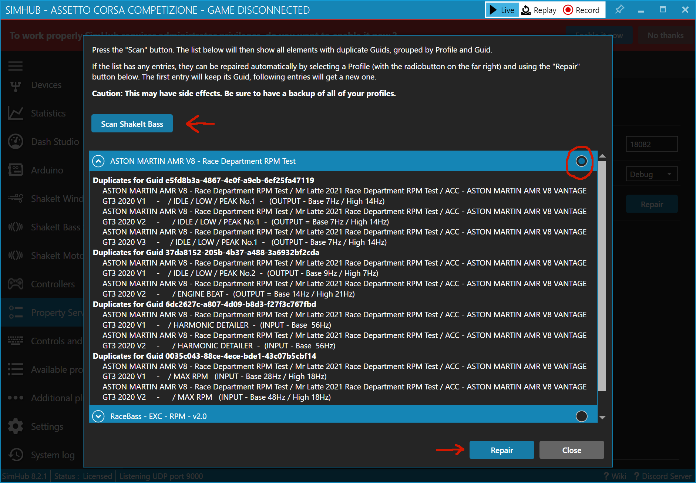

= SimHub Property Server
:toc:
:sectnums:
ifdef::env-github[]
:tip-caption: :bulb:
endif::[]
ifndef::env-github[]
:tip-caption: 💡
endif::[]

TIP: Always read the *correct version* of the documentation, which matches the version of the plugin that you have installed. To do so, use the dropdown in the top left, which usually contains the value "main". Select the "tag" that matches your installed version.

== About

This is a plugin for https://www.simhubdash.com/[SimHub]. It allows access to SimHub properties via a tcp connection.

Clients can subscribe for property changes. They will then receive updates each time, when the value of a subscribed property changes.

One use case is the project https://github.com/pre-martin/StreamDeckSimHubPlugin[StreamDeckSimHubPlugin], which allows updating the state of Stream Deck keys via SimHub properties.

== Installation

Simply copy the file `PropertyServer.dll` into the root directory of your SimHub installation. After having launched SimHub, the plugin has to be activated under "_Settings_ > _Plugins_" (usually SimHub will autodetect the plugin and ask at startup, if the plugin shall be activated).

Optionally, the checkbox "_Show in left menu_" can be activated. This will show an entry named "_Property Server_" in the left menu bar, which allows to adjust the settings of the plugin. If "_Show in left menu_" is not enabled, the settings of the plugin can be found under "_Additional Plugins_ > _Property Server_".

After installation, the checkbox "_Show in left menu_" can be found under "_Settings_ > _Plugins_".

== Usage

If you are an end user, you can skip this section and jump to the https://github.com/pre-martin/StreamDeckSimHubPlugin[StreamDeckSimHubPlugin]. But make sure you read the section <<available-props-help>>, because it contains important information about the SimHub properties you can use.

=== Connection

Open a telnet connection to `localhost` on port `18082` (or whatever port has been set in the settings). The Property Server will respond with its name:

----
$ telnet localhost 18082
SimHub Property Server
----

Now simply send `help` in order to receive a list of subscribable properties and a list of supported commands.

=== Example

The following shows an example of the communication. The characters `<` and `>` are not part of the communication, they are just used in this example to illustrate what has been sent by the server (`>`) and what has been sent by the client (`<`):

----
$ telnet localhost 18082
>SimHub Property Server
<subscribe dcp.gd.EngineIgnitionOn
>Property dcp.gd.EngineIgnitionOn integer (null)
<subscribe dcp.gd.IsPitlimiterOrPitLane
>Property dcp.gd.IsPitlimiterOrPitLane boolean (null)

>Property dcp.gd.EngineIgnitionOn integer 0
>Property dcp.gd.IsPitlimiterOrPitLane boolean True
>Property dcp.gd.EngineIgnitionOn integer 1
>Property dcp.gd.EngineIgnitionOn integer 0
<disconnect
----

In this example, the client subscribes to the ignition property and to "IsPitLimiterOrPitLane". Initially, as no game is running, both properties have a value of `null`, transmitted as `(null)`. When a game is launched, the ignition property changes to `0`, the "pitlane" property to "True", and the client receives both changes. Afterwards the ignition is toggled on and off in the game, before the client decides to `disconnect`.

Property names follow the convention of SimHub, e.g. `[DataCorePlugin.GameRunning]` is called `dcp.GameRunning` in this plugin, or `[DataCorePlugin.GameData.ABSLevel]` is called `dcp.gd.ABSLevel` in this plugin.

== Limitations

At the moment, there are two limitations in effect:

. The plugin will send data only at a rate of 10 Hz.
. No compound types or arrays are supported.

Limitation (1) was chosen because the plugin is not meant for real time communication. If real time is a requirement, then the UDP forwarding of SimHub should be used instead.

Limitation (2) could be changed, if there are requirements to read other properties. It's just a matter of implementing other data types.

[#available-props-help]
== Available properties and "Help"

=== Different sources of data

This plugin allows access to SimHub properties of different sources. These sources are distinguished by property name prefixes:

==== Prefix `dcp.*`

This prefix is mapped to a subset of the SimHub properties found in SimHub under "Available properties" in the section "DataCorePlugin". The available properties are listed in the section <<help>>.

This is the best performing option and the properties are returned in a typed manner (e.g. as `int` or `double`). This option should be preferred over the "generic" properties (see below).

To make the property names even shorter, the prefix `dcp.gd.\*` must be used to access properties which start with `DataCorePlugin.GameData.*`.

- Example 1: `dcp.GameRunning` must be used to access the SimHub property `DataCorePlugin.GameRunning` +
- Example 2: `dcp.gd.Brake` must be used to access the SimHub property `DataCorePlugin.GameData.Brake`

==== Prefix `acc.*`

This prefix is mapped to raw data properties from Assetto Corsa Competizione. The available properties are listed below in the section <<help>>.

Properties with this prefix perform as well as properties with the prefix `dcp` and they are also typed - just as `dcp` properties.

==== Prefix `sib.*`

Access to ShakeIt Bass profiles (effect groups and effects) is possible with this prefix. This prefix requires a very specific syntax:

----
sib.<guid>.gain|ismuted
----

* `<guid>` is the unique id of the effect group or effect. See output of the command `shakeit-bass-structure`: It will list all profiles, their effect groups and effects, including their guid.
* `gain` or `ismuted` specify, which property of the effect group or effect shall be addressed.

Example:

----
$ telnet localhost 18082
>SimHub Property Server
<shake-it-bass-structure
>[output omitted]
<subscribe sib.ff17edcb-c7b3-47e4-905c-a0d314447eab.gain
>Property sib.ff17edcb-c7b3-47e4-905c-a0d314447eab.gain double 100
<subscribe sib.ff17edcb-c7b3-47e4-905c-a0d314447eab.ismuted
>Property sib.ff17edcb-c7b3-47e4-905c-a0d314447eab.ismuted boolean False
----

In this example, the client retrieves the structure of all ShakeIt Bass profile, their effect groups and effects. Then it subscribes to one specific entry to the value "Gain" and "IsMuted". The SimHub Property server will now send "Property" messages when these values change.

==== No prefix, also known as "Generic" properties

If a property name does not start with one of the prefixes listed above, then a generic access is used. This allows access to almost all properties of SimHub.

The number of available properties depends on the plugins that are enabled in SimHub, but in a usual setup there should be around 2000 properties available - including custom properties exported by NCalc scripts.

These properties are not listed in the section <<help>>! Just search the properties you are interested in in SimHub under "Available properties" and use the "Copy name" function from the context menu.

The downsides of generic properties are:

- Access is a little bit slower (but that shouldn't be a problem - it's fractions of a millisecond)
- These properties are not typed - they are just returned as `object`.

The consequence of this second point is that client applications have to take care of the interpretation of the values themselves. Therefore the other prefixes should be used, if possible.

- Example 1: `ShakeItWindPlugin.DynamicGain` allows access to just this property
- Example 2: `SystemInfoPlugin.CPULoadPercent` allows access to just this property
- Example 3: Of course, names like `DataCorePlugin.GameData.Brake` can be used. But consider using `dcp.gd.Brake` instead (for the reasons mentioned above)
- Example 4: Your SimHub installation contains an NCalc script example in the file `<SimHub>\NCalcScripts\samples.ini`, which exports the properties `DataCorePlugin.ExternalScript.BlinkingGear` and `DataCorePlugin.ExternalScript.BlinkingGearUP`. These custom properties can be accessed just by exactly these names. +
  This allows you to convert values inside of SimHub with the help of NCalc for usage in external applications.

[#help,reftext=Help]
=== "Help"

This is the current output of the command `help`:

----
Available properties:
  acc.graphics.ABS integer
  acc.graphics.CarCount integer
  acc.graphics.clock double
  acc.graphics.CompletedLaps integer
  acc.graphics.CurrentSectorIndex integer
  acc.graphics.currentTyreSet integer
  acc.graphics.directionLightsLeft integer
  acc.graphics.directionLightsRight integer
  acc.graphics.DistanceTraveled double
  acc.graphics.DriverStintTimeLeft integer
  acc.graphics.DriverStintTotalTimeLeft integer
  acc.graphics.EngineMap integer
  acc.graphics.ExhaustTemperature double
  acc.graphics.FlashingLights integer
  acc.graphics.fuelEstimatedLaps double
  acc.graphics.FuelXLap double
  acc.graphics.gapAhead integer
  acc.graphics.gapBehind integer
  acc.graphics.GetHashCode integer
  acc.graphics.globalChequered integer
  acc.graphics.globalGreen integer
  acc.graphics.globalRed integer
  acc.graphics.globalWhite integer
  acc.graphics.globalYellow integer
  acc.graphics.globalYellow1 integer
  acc.graphics.globalYellow2 integer
  acc.graphics.globalYellow3 integer
  acc.graphics.iBestTime integer
  acc.graphics.iCurrentTime integer
  acc.graphics.IdealLineOn integer
  acc.graphics.iDeltaLapTime integer
  acc.graphics.iEstimatedLapTime integer
  acc.graphics.iLastTime integer
  acc.graphics.isDeltaPositive integer
  acc.graphics.IsInPit integer
  acc.graphics.IsInPitLane integer
  acc.graphics.iSplit integer
  acc.graphics.IsSetupMenuVisible integer
  acc.graphics.isValidLap integer
  acc.graphics.LastSectorTime integer
  acc.graphics.LightsStage integer
  acc.graphics.MainDisplayIndex integer
  acc.graphics.MandatoryPitDone integer
  acc.graphics.mfdFuelToAdd double
  acc.graphics.mfdTyrePressureLF double
  acc.graphics.mfdTyrePressureLR double
  acc.graphics.mfdTyrePressureRF double
  acc.graphics.mfdTyrePressureRR double
  acc.graphics.mfdTyreSet integer
  acc.graphics.missingMandatoryPits integer
  acc.graphics.NormalizedCarPosition double
  acc.graphics.NumberOfLaps integer
  acc.graphics.PacketId integer
  acc.graphics.PenaltyTime double
  acc.graphics.PlayerCarID integer
  acc.graphics.Position integer
  acc.graphics.RainLights integer
  acc.graphics.RainTyres integer
  acc.graphics.ReplayTimeMultiplier double
  acc.graphics.SecondaryDisplayIndex integer
  acc.graphics.SessionIndex integer
  acc.graphics.SessionTimeLeft double
  acc.graphics.strategyTyreSet integer
  acc.graphics.SurfaceGrip double
  acc.graphics.TC integer
  acc.graphics.TCCut integer
  acc.graphics.UsedFuel double
  acc.graphics.WindDirection double
  acc.graphics.WindSpeed double
  acc.graphics.WiperLV integer
  acc.physics.Abs double
  acc.physics.absinAction integer
  acc.physics.absVibrations double
  acc.physics.AirDensity double
  acc.physics.AirTemp double
  acc.physics.AutoShifterOn integer
  acc.physics.Ballast double
  acc.physics.Brake double
  acc.physics.BrakeBias double
  acc.physics.CgHeight double
  acc.physics.Clutch double
  acc.physics.currentMaxRpm double
  acc.physics.Drs double
  acc.physics.DrsAvailable integer
  acc.physics.DrsEnabled integer
  acc.physics.EngineBrake integer
  acc.physics.ErsHeatCharging integer
  acc.physics.ErsisCharging integer
  acc.physics.ErsPowerLevel integer
  acc.physics.ErsRecoveryLevel integer
  acc.physics.FinalFF double
  acc.physics.frontBrakeCompound integer
  acc.physics.Fuel double
  acc.physics.Gas double
  acc.physics.Gear integer
  acc.physics.GetHashCode integer
  acc.physics.gVibrations double
  acc.physics.Heading double
  acc.physics.ignitionOn integer
  acc.physics.IsAIControlled integer
  acc.physics.isEngineRunning integer
  acc.physics.kerbVibration double
  acc.physics.KersCharge double
  acc.physics.KersCurrentKJ double
  acc.physics.KersInput double
  acc.physics.NumberOfTyresOut integer
  acc.physics.P2PActivation integer
  acc.physics.P2PStatus integer
  acc.physics.PacketId integer
  acc.physics.PerformanceMeter double
  acc.physics.Pitch double
  acc.physics.PitLimiterOn integer
  acc.physics.rearBrakeCompound integer
  acc.physics.RoadTemp double
  acc.physics.Roll double
  acc.physics.Rpms integer
  acc.physics.slipVibrations double
  acc.physics.SpeedKmh double
  acc.physics.starterEngineOn integer
  acc.physics.SteerAngle double
  acc.physics.TC double
  acc.physics.tcinAction integer
  acc.physics.Turbo double
  acc.physics.waterTemperature double
  dcp.GameInMenu boolean
  dcp.GamePaused boolean
  dcp.GameReplay boolean
  dcp.GameRunning boolean
  dcp.gd.ABSActive integer
  dcp.gd.ABSLevel integer
  dcp.gd.AirTemperature double
  dcp.gd.BestLapOpponentPosition integer
  dcp.gd.Brake double
  dcp.gd.BrakeBias double
  dcp.gd.BrakesTemperatureAvg double
  dcp.gd.BrakesTemperatureMax double
  dcp.gd.BrakesTemperatureMin double
  dcp.gd.BrakeTemperatureFrontLeft double
  dcp.gd.BrakeTemperatureFrontRight double
  dcp.gd.BrakeTemperatureRearLeft double
  dcp.gd.BrakeTemperatureRearRight double
  dcp.gd.CarDamage1 double
  dcp.gd.CarDamage2 double
  dcp.gd.CarDamage3 double
  dcp.gd.CarDamage4 double
  dcp.gd.CarDamage5 double
  dcp.gd.CarDamagesAvg double
  dcp.gd.CarDamagesMax double
  dcp.gd.CarDamagesMin double
  dcp.gd.CarSettings_CurrentDisplayedRPMPercent double
  dcp.gd.CarSettings_CurrentGearRedLineRPM double
  dcp.gd.CarSettings_FuelAlertActive integer
  dcp.gd.CarSettings_FuelAlertEnabled integer
  dcp.gd.CarSettings_FuelAlertFuelRemainingLaps double
  dcp.gd.CarSettings_FuelAlertLaps double
  dcp.gd.CarSettings_MaxFUEL double
  dcp.gd.CarSettings_MaxGears integer
  dcp.gd.CarSettings_MaxRPM double
  dcp.gd.CarSettings_MinimumShownRPM double
  dcp.gd.CarSettings_RedLineDisplayedPercent double
  dcp.gd.CarSettings_RedLineRPM double
  dcp.gd.CarSettings_RPMRedLinePerGearOverride integer
  dcp.gd.CarSettings_RPMRedLineReached double
  dcp.gd.CarSettings_RPMRedLineSetting double
  dcp.gd.CarSettings_RPMShiftLight1 double
  dcp.gd.CarSettings_RPMShiftLight2 double
  dcp.gd.Clutch double
  dcp.gd.CompletedLaps integer
  dcp.gd.CurrentLap integer
  dcp.gd.CurrentSectorIndex integer
  dcp.gd.DraftEstimate double
  dcp.gd.DRSAvailable integer
  dcp.gd.DRSEnabled integer
  dcp.gd.EngineIgnitionOn integer
  dcp.gd.EngineMap integer
  dcp.gd.EngineStarted integer
  dcp.gd.EngineTorque double
  dcp.gd.ERSMax double
  dcp.gd.ERSPercent double
  dcp.gd.ERSStored double
  dcp.gd.FilteredRpms double
  dcp.gd.FilteredSpeedKmh double
  dcp.gd.FilteredSpeedLocal double
  dcp.gd.FilteredSpeedMph double
  dcp.gd.Flag_Black integer
  dcp.gd.Flag_Blue integer
  dcp.gd.Flag_Checkered integer
  dcp.gd.Flag_Green integer
  dcp.gd.Flag_Orange integer
  dcp.gd.Flag_White integer
  dcp.gd.Flag_Yellow integer
  dcp.gd.Fuel double
  dcp.gd.FuelPercent double
  dcp.gd.FuelRaw double
  dcp.gd.GlobalAccelerationG double
  dcp.gd.Handbrake double
  dcp.gd.InstantConsumption_L100KM double
  dcp.gd.InstantConsumption_MPG_UK double
  dcp.gd.InstantConsumption_MPG_US double
  dcp.gd.IsInPit integer
  dcp.gd.IsInPitLane integer
  dcp.gd.IsInPitSince double
  dcp.gd.IsLapValid boolean
  dcp.gd.IsPitlimiterOrPitLane boolean
  dcp.gd.LastLapTyreWearFrontLeft double
  dcp.gd.LastLapTyreWearFrontRight double
  dcp.gd.LastLapTyreWearRearLeft double
  dcp.gd.LastLapTyreWearRearRight double
  dcp.gd.LastPitStopDuration double
  dcp.gd.MapAllowed boolean
  dcp.gd.MaxEngineTorque double
  dcp.gd.MaxFuel double
  dcp.gd.MaxRpm double
  dcp.gd.MaxSpeedKmh double
  dcp.gd.MaxSpeedLocal double
  dcp.gd.MaxSpeedMph double
  dcp.gd.MaxTurbo double
  dcp.gd.MaxTurboBar double
  dcp.gd.OilPressure double
  dcp.gd.OilTemperature double
  dcp.gd.OpponentsCount integer
  dcp.gd.OrientationPitch double
  dcp.gd.OrientationRoll double
  dcp.gd.OrientationYaw double
  dcp.gd.OrientationYawWorld double
  dcp.gd.PitLimiterOn integer
  dcp.gd.PlayerClassOpponentsCount integer
  dcp.gd.Position integer
  dcp.gd.Redline double
  dcp.gd.RemainingLaps integer
  dcp.gd.ReportedTrackLength double
  dcp.gd.RoadTemperature double
  dcp.gd.Rpms double
  dcp.gd.SessionOdo double
  dcp.gd.SessionOdoLocalUnit double
  dcp.gd.Spectating boolean
  dcp.gd.SpeedKmh double
  dcp.gd.SpeedLocal double
  dcp.gd.SpeedMph double
  dcp.gd.SpotterCarLeft integer
  dcp.gd.SpotterCarLeftAngle double
  dcp.gd.SpotterCarLeftDistance double
  dcp.gd.SpotterCarRight integer
  dcp.gd.SpotterCarRightAngle double
  dcp.gd.SpotterCarRightDistance double
  dcp.gd.StintOdo double
  dcp.gd.StintOdoLocalUnit double
  dcp.gd.TCActive integer
  dcp.gd.TCLevel integer
  dcp.gd.Throttle double
  dcp.gd.TotalLaps integer
  dcp.gd.TrackLength double
  dcp.gd.TrackPositionPercent double
  dcp.gd.Turbo double
  dcp.gd.TurboBar double
  dcp.gd.TurboPercent double
  dcp.gd.TurnIndicatorLeft integer
  dcp.gd.TurnIndicatorRight integer
  dcp.gd.TyreDirtFrontLeft double
  dcp.gd.TyreDirtFrontRight double
  dcp.gd.TyreDirtRearLeft double
  dcp.gd.TyreDirtRearRight double
  dcp.gd.TyrePressureFrontLeft double
  dcp.gd.TyrePressureFrontRight double
  dcp.gd.TyrePressureRearLeft double
  dcp.gd.TyrePressureRearRight double
  dcp.gd.TyresDirtyLevelAvg double
  dcp.gd.TyresDirtyLevelMax double
  dcp.gd.TyresDirtyLevelMin double
  dcp.gd.TyresTemperatureAvg double
  dcp.gd.TyresTemperatureMax double
  dcp.gd.TyresTemperatureMin double
  dcp.gd.TyresWearAvg double
  dcp.gd.TyresWearMax double
  dcp.gd.TyresWearMin double
  dcp.gd.TyreTemperatureFrontLeft double
  dcp.gd.TyreTemperatureFrontLeftInner double
  dcp.gd.TyreTemperatureFrontLeftMiddle double
  dcp.gd.TyreTemperatureFrontLeftOuter double
  dcp.gd.TyreTemperatureFrontRight double
  dcp.gd.TyreTemperatureFrontRightInner double
  dcp.gd.TyreTemperatureFrontRightMiddle double
  dcp.gd.TyreTemperatureFrontRightOuter double
  dcp.gd.TyreTemperatureRearLeft double
  dcp.gd.TyreTemperatureRearLeftInner double
  dcp.gd.TyreTemperatureRearLeftMiddle double
  dcp.gd.TyreTemperatureRearLeftOuter double
  dcp.gd.TyreTemperatureRearRight double
  dcp.gd.TyreTemperatureRearRightInner double
  dcp.gd.TyreTemperatureRearRightMiddle double
  dcp.gd.TyreTemperatureRearRightOuter double
  dcp.gd.TyreWearFrontLeft double
  dcp.gd.TyreWearFrontRight double
  dcp.gd.TyreWearRearLeft double
  dcp.gd.TyreWearRearRight double
  dcp.gd.WaterTemperature double
  dcp.Spectating boolean
Available commands:
  subscribe propertyName
  unsubscribe propertyName
  trigger-input inputName
  trigger-input-pressed inputName
  trigger-input-released inputName
  shakeit-bass-structure
  disconnect
----

== How to repair "ShakeIt" profiles

ShakeIt properties are accessed by this plugin through an unique id (called "GUID"), which is managed by SimHub. Unfortunately, SimHub does not enforce that these Guids are really unique. So it can happen, that you are affected by problems caused by duplicate Guids: **You address one effect, but actually get the value of another effect.**

You have to repair these duplicated Guids. If you are responsible for a profile, you should repair the profile before distributing it. If you import a profile from another maintainer, you can test the profile. If it has duplicate Guids, you should inform the maintainer and ask him to repair the profile.

This is done as follows:

. Open the settings of this plugin. If "show in left menu" is enabled for this plugin, just click on "Property Server" in the left menu, otherwise go via "Additional plugins" - "Property Server".
. Click on the button labeled "Repair" (in the background of the screenshot above).
. The window shown above appears.
. Press on "Scan" in the upper area of the window.
.. If a message appears, that there a no duplicates: Everything is fine.
.. If you get a list as in the screenshot above: Please continue.
. The list displays all elements with duplicate Guids. Select the profile that you want to repair with the radiobutton on the far right.
. Click on "Repair".

== Building of the plugin

See link:doc/Building.adoc[Building.adoc].
