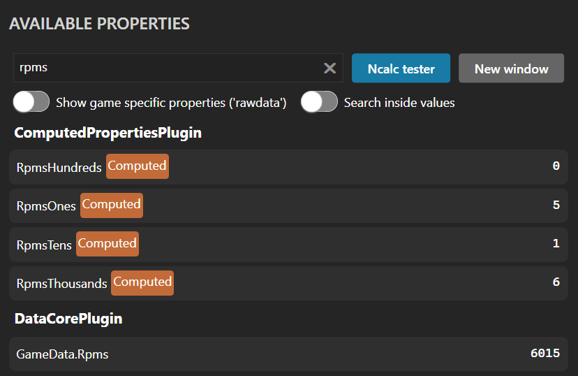
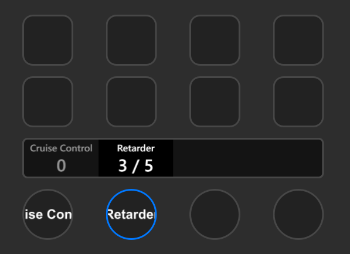
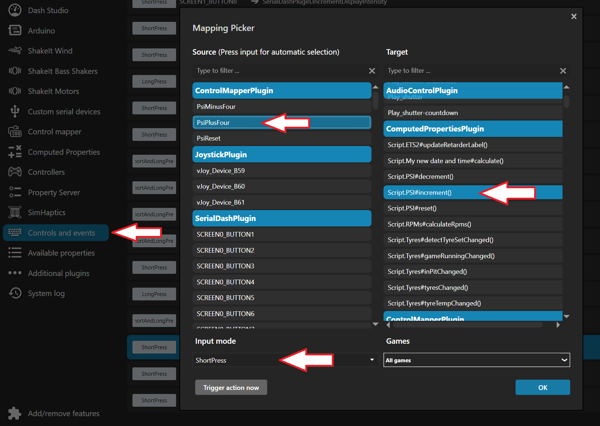
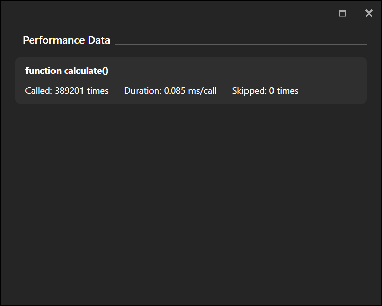

= Computed Properties
:toc:
:sectnums:
ifdef::env-github[]
:tip-caption: :bulb:
:warning-caption: :warning:
endif::[]
ifndef::env-github[]
:tip-caption: 💡
:warning-caption: ⚠️
endif::[]

TIP: Always read the *correct version* of the documentation, which matches the version of the plugin that you have installed. To do so, use the dropdown in the top left, which usually contains the value "main". Select the "tag" that matches your installed version.

== About

As written on the main page, this plugin allows you to execute user-defined JavaScript code within SimHub.

With this code, you can define new properties, which are calculated from the values of other properties (thus the name of the plugin). Your new properties are available everywhere in SimHub, where properties can be used, for example, in SimHub Dashes or on the keys of your Stream Deck (see my other project https://github.com/pre-martin/StreamDeckSimHubPlugin[StreamDeckSimHubPlugin]).

Your code is executed whenever other properties change their value (you can "subscribe" to other properties). Alternatively, your code can also be linked with SimHub Controls or SimHub Control Mapper Roles: Whenever this is triggered, your associated code is executed.

== Structure of a script

Each script must contain an `init()` function. This function is called once, whenever the script gets active (start of the plugin, selection of a new game in SimHub, after having modified the script). In this `init()` function, you can define/create your properties, subscribe to other properties and initialize local variables of your script.

Additionally, you can define as many functions as you like. They get either called, when the value of a subscribed property has changed, when a linked SimHub Control was triggered, or you can call them from other functions. All the functions that get called from the outside must be parameterless.

In addition to the code, each script must also have a name. To avoid confusion, this name should be meaningful and **unique**.

Each script is executed in its own context. This means that scripts cannot access variables or functions from other scripts.

== Available Commands

TIP: Your scripts have to use JavaScript, not TypeScript. So there is no typing information or type validation available. Nevertheless, I will specify the types of the parameters in the following, as the typing is relevant for SimHub and my plugin itself (SimHub and my plugin are written in C#).

**log(message: object)**

Logs the given message into `<SimHub>\Logs\ComputedProperties.log`.

Be careful with this command, because your functions could be called as often as 60 times per second. This is the internal frequency of SimHub if you use the licensed version.

**createProperty(name: string)**

Used in the `init()` function to create a new property. The name must always be fully qualified and therefore have the prefix `ComputedPropertiesPlugin.`.

**subscribeToProperty(name: string, function: string)**

Also used in the `init()` function. This instructs the plugin to watch the value of the property named __name__. Whenever the value changes, your function named __function__ is called.

**getPropertyValue(name: string): object**

Returns the current value of the property named __name__. The name must again be fully qualified. Be careful, as the return value could be `null`.

**setPropertyValue(name: string, value: object)**

Sets the value of your (!) property named __name__ to __value__. The property must have been "created" before with the command `createProperty(name: string)`.

== Examples

=== Example 1: The most useless example

[source,javascript,linenums]
----

/** Initialization. Only called by the plugin once for each script. */
function init() {
  // create a new property in SimHub
  createProperty('ComputedPropertiesPlugin.MyNewDateAndTime');
  // instruct the plugin to call 'calculate' (see below) whenever 'DataCorePlugin.CurrentDateTime' changes
  subscribe('DataCorePlugin.CurrentDateTime', 'calculate');
}

/** Called by the plugin whenever a corresponding property value (subscription) has changed. */
function calculate() {
  const currentDateTime = getPropertyValue('DataCorePlugin.CurrentDateTime');
  // set the value of the computed property.
  setPropertyValue('ComputedPropertiesPlugin.MyNewDateAndTime', 'My time and date: ' + currentDateTime);
}
----

When you click on the "Insert sample" button, the content of the script editor gets replaced by this code.

What does this script do?

1. It defines the mandatory `init()` function.
2. In this function, a new property is created with the name `ComputedPropertiesPlugin.MyNewDateAndTime`.
3. The script instructs the plugin to call the function `calculate()` whenever the value of the property `DataCorePlugin.CurrentDateTime` changes. Pay particular attention to the syntax of the 2nd parameter, the `function`: This is specified as a string and without parenthesis.
4. Then it defines the function `calculate()`.
5. It retrieves the current value of the property `DataCorePlugin.CurrentDateTime`.
6. It prepends this value with some text and sets the result as the new value of the property `ComputedPropertiesPlugin.MyNewDateAndTime`.

When the script has been saved, head over to the menu entry "Available properties" and scroll down until you find the section "ComputedPropertiesPlugin". There you should see your new property and how it updates its value each second.

Actually, your function `calculate()` is called 60 times per second. So be careful what you do inside, because you could easily mess up SimHub. It is always important to keep the execution time of your functions as short as possible. Always use the tool <<performance-data>> to check the performance of your scripts.

=== Example 2: Split RPM into individual digits

Maybe you do not want to display the RPM as a whole number, but you want to display each digit separately. Maybe only the thousands and the hundreds on your Stream Deck. This script does exactly that:

[source,javascript,linenums]
----
function init() {
    createProperty('ComputedPropertiesPlugin.RpmsThousands');
    createProperty('ComputedPropertiesPlugin.RpmsHundreds');
    createProperty('ComputedPropertiesPlugin.RpmsTens');
    createProperty('ComputedPropertiesPlugin.RpmsOnes');
    subscribe('DataCorePlugin.GameData.Rpms', 'calculateRpms');
}

function calculateRpms() {
    var rpms = getPropertyValue('DataCorePlugin.GameData.Rpms');
    var thousands = Math.floor(rpms / 1000);
    var hundreds = Math.floor((rpms - thousands * 1000) / 100);
    var tens = Math.floor((rpms - thousands * 1000 - hundreds * 100) / 10);
    var ones = Math.floor(rpms - thousands * 1000 - hundreds * 100 - tens * 10);
    setPropertyValue('ComputedPropertiesPlugin.RpmsThousands', thousands);
    setPropertyValue('ComputedPropertiesPlugin.RpmsHundreds', hundreds);
    setPropertyValue('ComputedPropertiesPlugin.RpmsTens', tens);
    setPropertyValue('ComputedPropertiesPlugin.RpmsOnes', ones);
}
----

You can then use the individual properties and maybe display them on your Stream Deck:

[.text-center]

=== Example 3: Euro Truck Simulator 2 Retarder

The Stream Deck is a perfect device to control the many functions of a truck. You could use two buttons to control the retarder of your truck. Or even a dial of your Stream Deck +.

However, especially when using a Stream Deck + dial, you can only display one value in the Stream Deck plugin, but it would be desirable to display both the current retarder level and the total number of possible levels.

The following script does exactly that:

[source,javascript,linenums]
----
function init() {
  createProperty('ComputedPropertiesPlugin.ETS2.RetarderLabel');
  subscribe('DataCorePlugin.GameRawData.TruckValues.CurrentValues.MotorValues.BrakeValues.RetarderLevel', 'updateRetarderLabel');
  subscribe('DataCorePlugin.GameRawData.TruckValues.ConstantsValues.MotorValues.RetarderStepCount', 'updateRetarderLabel');
}

function updateRetarderLabel() {
  var level = getPropertyValue('DataCorePlugin.GameRawData.TruckValues.CurrentValues.MotorValues.BrakeValues.RetarderLevel');
  var count = getPropertyValue('DataCorePlugin.GameRawData.TruckValues.ConstantsValues.MotorValues.RetarderStepCount');

  setPropertyValue('ComputedPropertiesPlugin.ETS2.RetarderLabel', `${level} / ${count}`);
}
----

And it could like this on your Stream Deck +:

[.text-center]

== Bind a SimHub Control to your function

You can bind a SimHub Control to your function. This means that whenever the SimHub Control is triggered, your function is called. This can be achieved by the following steps:

1. Open "Controls and events" in SimHub.
2. On the "Controls" tab, press "New mapping" and the following dialog will appear.
3. Press the control (could be a Stream Deck button with my Stream Deck plugin) you want to bind.
4. Adjust the "Input mode" if required.
5. Select the function on the right side.

In the screenshot, the Control Mapper Role "PsiPlusFour" is being mapped to the function "increment()" of the script "PSI":

SimHub does not support to update the name of actions (or "Target" in this dialog). The action name for your functions is built from the name of the script and the name of the function. Whenever you rename your script or your function, you will lose this binding.

TIP: On the tab "Events", SimHub has some predefined events that you can also use to trigger your code. There you will find useful events like "NewValidLap", all different race flags, "PitEnter", "PitOut" and some more.

[#performance-data]
== Performance Data

In the list of all your computed properties, there is an info icon for each script. If you open it, you get some performance data, which may help you to get an overview about the performance impact of your script to SimHub:

This window lists each of your functions, except of the `init()` function. For each function, you get the following information:

- **Calls**: The number of times the function has been called.
- **Duration**: The average duration of the execution time of the function in milliseconds per call.
- **Skipped**: How often the function has not been called, because the value of a subscribed property did not change. If this value is very low (like in the screenshot), your function has a high impact on SimHub, because it is executed very often. Maybe you could subscribe to other properties, if possible, or you could implement some logic that the code in your function only gets executed upon each __n__th call.

Internal functions (that do not get called from the outside by the plugin) won't have any performance data, because the plugin cannot survey their execution.

You can find this data also when you exit SimHub. The plugin will then dump the performance data into the log file `<SimHub>\Logs\ComputedProperties.log`.